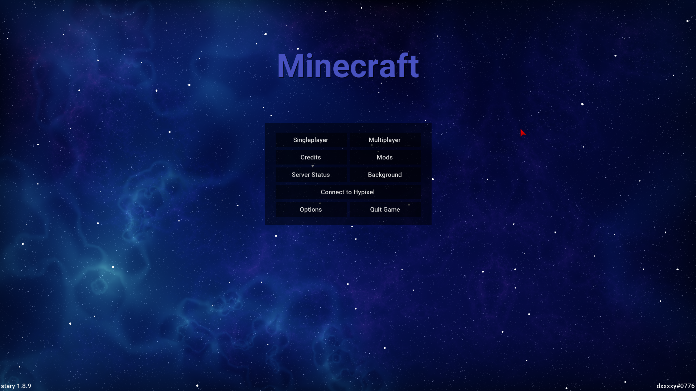
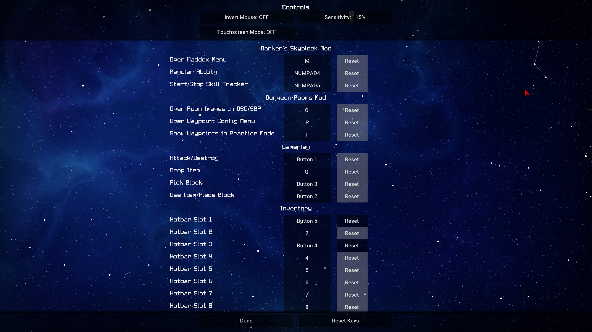
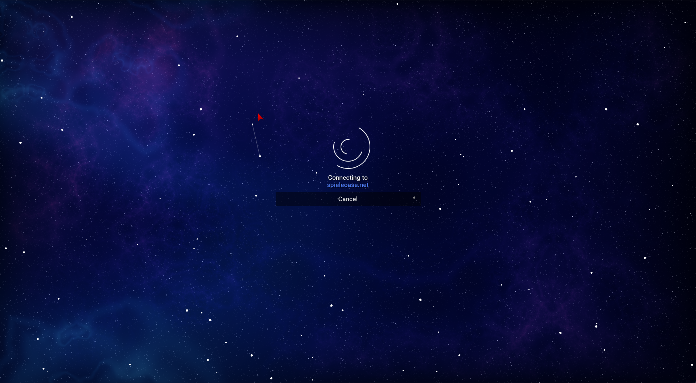
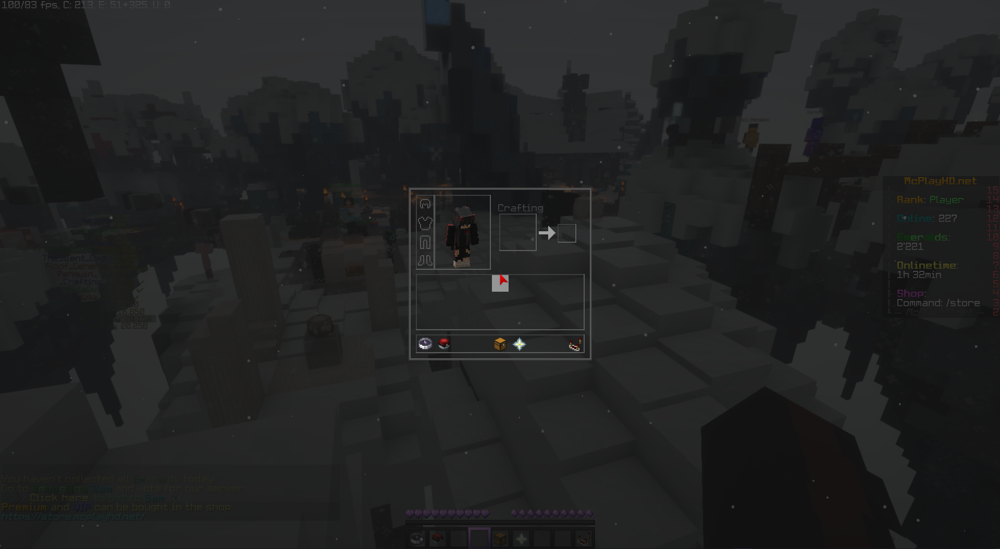

# stary
A modern and slick look for the Minecraft UI. Directly stripped from [LiquidBounce/legacy](https://github.com/CCBlueX/LiquidBounce/tree/legacy) + some tweaks.

## Features
- An animated shader present on the main menu (and other screens while not in a world).
- Particles are rendered everywhere `GuiScreen#drawClientBackground()` is called (even in inventory).
- All buttons have a slick and modern look to them.
- The font [Roboto-Medium](https://fonts.google.com/specimen/Roboto) is used for rendering the UI text.
- Tried to eliminate all occurrences of a "dirt" background.

## Some screenshots

## License
> From [LiquidBounce/legacy](https://github.com/CCBlueX/LiquidBounce/tree/legacy)

This project is subject to the [GNU General Public License v3.0](LICENSE). This does only apply for source code located directly in this clean repository. During the development and compilation process, additional source code may be used to which we have obtained no rights. Such code is not covered by the GPL license.

For those who are unfamiliar with the license, here is a summary of its main points. This is by no means legal advice nor legally binding.

You are allowed to
- use
- share
- modify

this project entirely or partially for free and even commercially. However, please consider the following:

- **You must disclose the source code of your modified work and the source code you took from this project. This means you are not allowed to use code from this project (even partially) in a closed-source (or even obfuscated) application.**
- **Your modified application must also be licensed under the GPL**

Do the above and share your source code with everyone; just like we do.